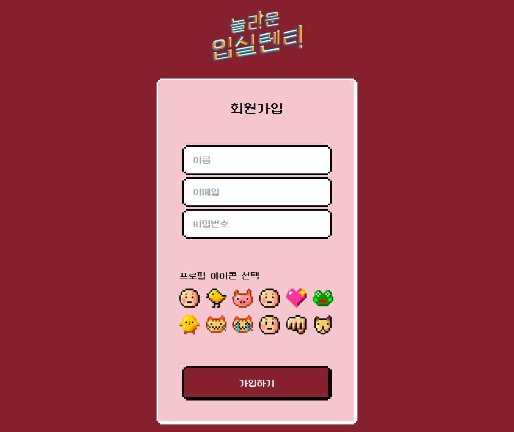
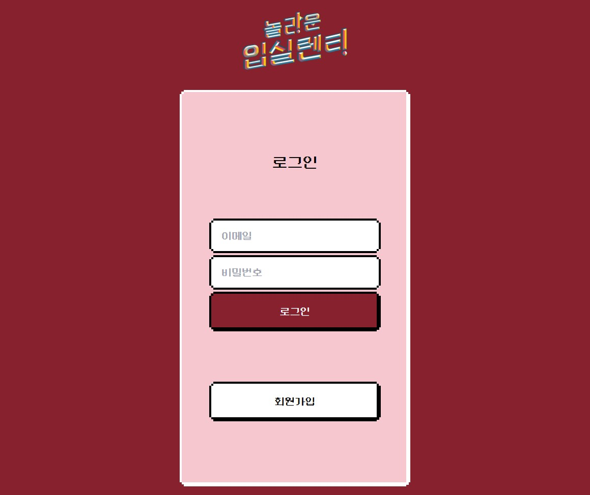
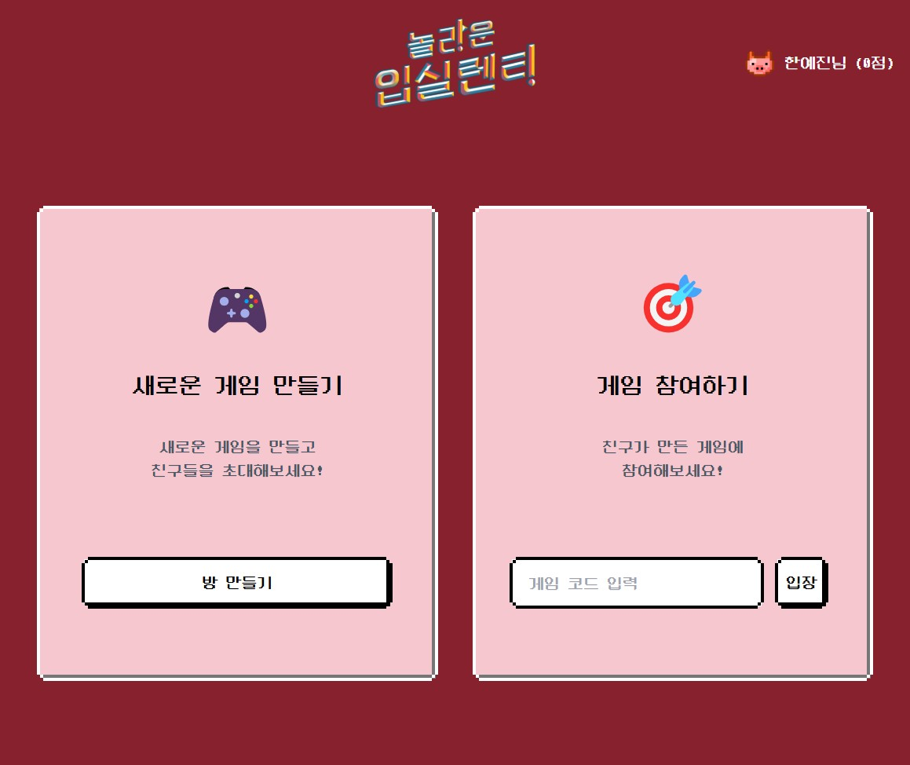
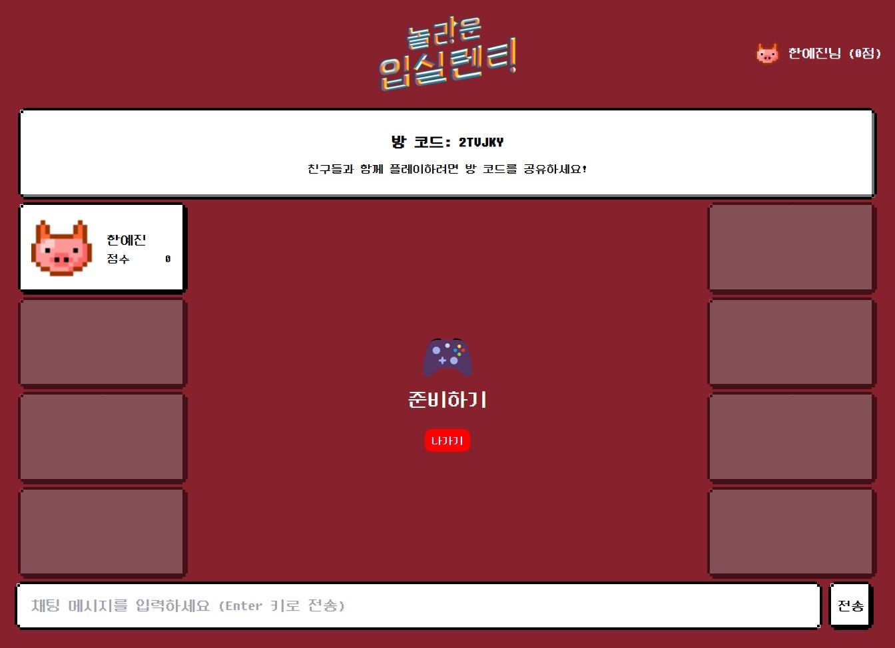
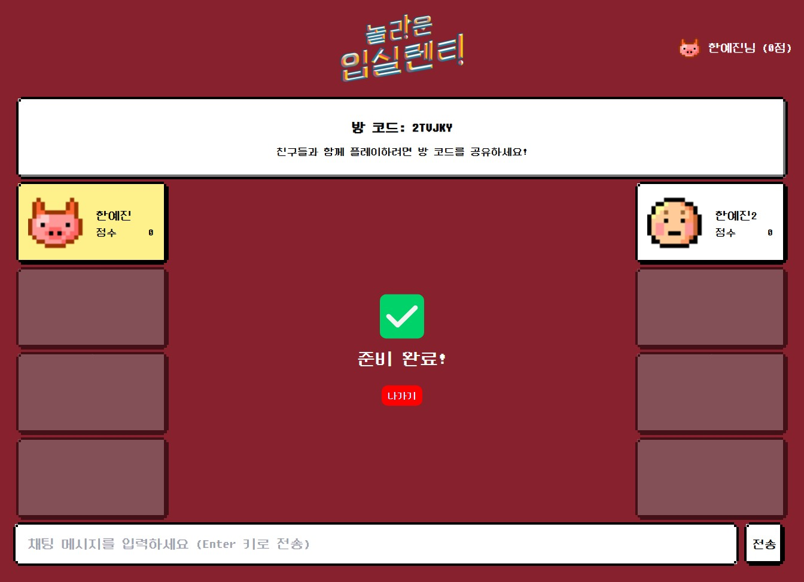
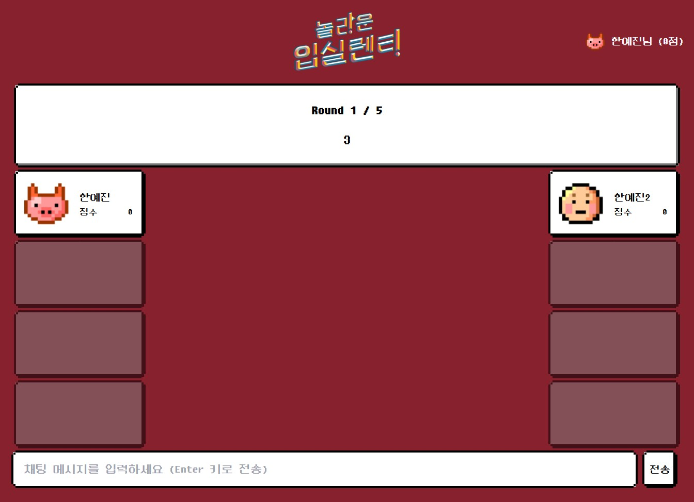
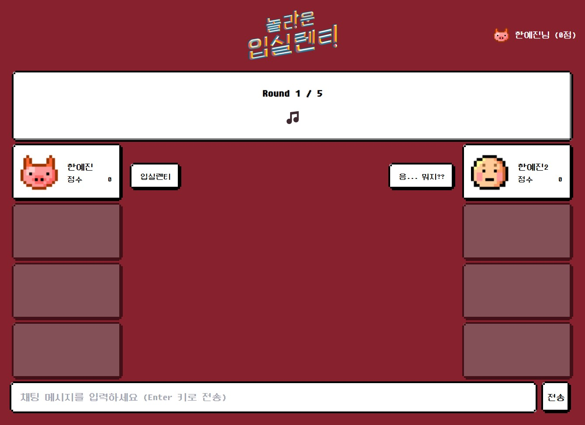
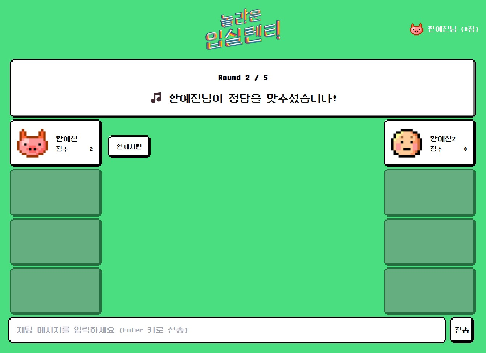
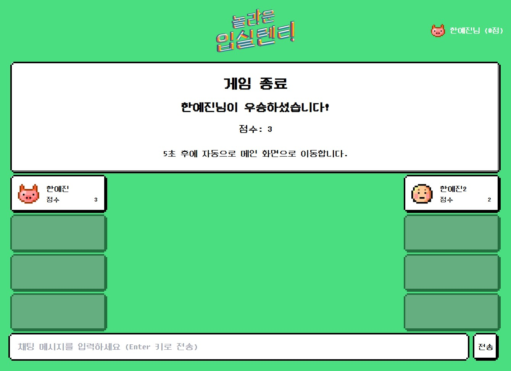

# 🏆 2025 NEXT 해커톤 우승작 '놀라운 입실렌티' - 고려대 응원가 맞히기 게임


고려대학교 응원가를 3초 듣고 맞히는 실시간 멀티플레이어 웹 게임

## 🎮 게임 소개
- 1~8명의 플레이어가 실시간으로 참여 가능한 응원가 맞히기 게임
- 3초간 재생되는 응원가를 듣고 채팅으로 정답을 맞히는 방식
- 총 5라운드 진행, 가장 많은 점수를 획득한 플레이어가 승리

⚠️ 해커톤에서 24시간 동안 1인 개발로 완성한 게임입니다. 짧은 개발 시간으로 인해 Cursor AI를 적극 활용하여 코드를 작성했습니다. 따라서 코드 품질이 다소 일관적이지 않을 수 있으며, 향후 리팩토링이 필요한 상태입니다.

## 🛠 기술 스택
- **Frontend**: React, TailwindCSS
- **UI Framework**: Pixel RetroUI (v2.1.0) - 레트로 게임 스타일의 UI 컴포넌트
- **Font**: 둥근모꼴 (Dunggeunmo) - 레트로 감성의 한글 픽셀 폰트
- **Backend**: WebSocket (실시간 통신)
- **Database & Auth**: Firebase
- **Development Tool**: Cursor AI
- **상태관리**: Zustand

## 📁 주요 프로젝트 구조
```
src/
├── pages/           # 페이지 컴포넌트
│   ├── Home.jsx          # 시작 화면
│   ├── Auth.jsx          # 회원가입/로그인 페이지
│   ├── Lobby.jsx         # 게임 로비 (방 생성/참여)
│   └── Game.jsx          # 실제 게임 진행 페이지
│
├── store/           # 전역 상태 관리
│   ├── gameStore.js      # 게임 상태 (점수, 라운드, 타이머 등)
│   ├── userStore.js      # 유저 정보 (로그인, 프로필 등)
│   └── roomStore.js      # 방 정보 (참가자, 준비 상태 등)
│
├── components/game/
│   ├── room/        # 게임방 생성/참여 관련 컴포넌트
│   │   ├── CreateGame.jsx    # 새로운 게임방 생성
│   │   └── JoinGame.jsx      # 코드로 게임방 참여
│   │
│   ├── field/       # 실제 게임 진행 컴포넌트
│   │   ├── GameField.jsx     # 게임 화면 및 음원 재생
│   │   ├── Chat.jsx          # 실시간 채팅 및 정답 제출
│   │   └── Score.jsx         # 실시간 점수 집계
│   │
│   ├── ui/          # 게임 UI 컴포넌트
│   │   ├── Timer.jsx         # 게임 타이머
│   │   ├── PlayerList.jsx    # 참가자 목록
│   │   └── ReadyButton.jsx   # 게임 준비 상태 관리
│   │
└── └── SocketProvider.jsx    # WebSocket 연결 및 이벤트 관리
```
## 🎯 게임 플레이 플로우

### 1. 회원가입


- 이메일과 비밀번호로 가입할 수 있습니다.
- Firebase Authentication으로 안전하게 관리됩니다.

### 2. 로그인


- 로그인을 해야 메인 화면으로 진입이 가능합니다.

### 3. 게임 로비


- 새로운 방을 만들거나 친구가 만든 방에 들어갈 수 있습니다.

### 4. 대기실 입장


- 방 코드는 랜덤으로 생성됩니다.
- 대기실에 누가 들어왔는지 실시간으로 확인할 수 있습니다.
- 채팅이 가능합니다.

### 5. 게임 준비


- 가운데 준비하기 버튼을 눌러 준비할 수 있습니다.

### 6. 게임 시작


- 모든 플레이어가 준비를 완료하면 카운트 다운 후 게임이 시작됩니다.

### 7. 게임 진행


- 3초 동안 응원가가 재생됩니다.
- 채팅창에 정답을 빨리 입력해보세요.

### 8. 정답 확인


- 가장 빨리 정답을 맞힌 사람에게 점수가 부여됩니다.

### 9. 게임 종료


- 모든 점수를 합산해서 최종 우승자를 가립니다.